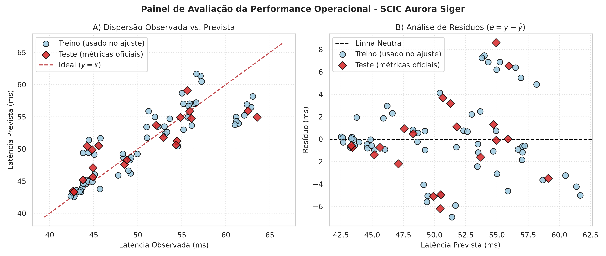

# Relatório Técnico - SCIC (Sistema de Comunicação Interplanetária da Colônia)

**Projeto:** Aurora Siger - Atividade Integradora da Fase 6 (FIAP)
**Equipe:** Bruno, Aelton, Michelly e Victor

---

## 1. Contexto da solução

A colônia Aurora Siger depende de comunicação estável entre seus módulos (suporte vital, energia,
habitação, laboratório, agricultura, controle térmico e comunicação). Se a latência de um módulo
sobe além do esperado, decisões importantes podem chegar atrasadas.

O SCIC é um protótipo em Python que:

1. organiza os dados operacionais e de comunicação dos módulos;
2. prevê a latência esperada de cada módulo e mede o erro dessa previsão;
3. transforma os desvios em alertas com severidade de 1 a 5 e os prioriza com um **heap**;
4. permite localizar módulos e sensores por prefixo com uma **trie**;
5. relaciona os dados com dispositivos, bases numéricas e eletricidade básica;
6. entrega uma análise final para apoiar a decisão da equipe humana.

Tudo é executado por um menu de terminal (`codigo_fonte.py`), que reúne quatro módulos:
`hardware_coa.py`, `ml_model.py`, `numerical_analysis.py` e `structures.py`. Os dados e os sensores
são **simulados**, o que o enunciado permite.

## 2. Descrição dos dados

A base `dados_aurora_siger.csv` foi gerada por `gerar_dados.py` (semente fixa 42, o que garante
reprodutibilidade) e tem **80 registros**: 8 módulos observados em 10 ciclos operacionais.

| Campo | Significado |
|---|---|
| `modulo_nome`, `modulo_tipo` | Nome e tipo do módulo (ex.: habitação, comunicação) |
| `sensor_hex_id` | Código do sensor em hexadecimal (ex.: `0xA1F3`) |
| `latencia_observada_ms` | Latência medida |
| `tensao_v`, `corrente_a` | Grandezas elétricas do módulo |
| `status` | `ativo`, `alerta` ou `manutencao` |
| `prioridade` | Importância do módulo (1 = mais essencial) |
| `ciclo` | Ciclo de registro (1 a 10) |
| `latencia_prevista_ms` | Previsão do modelo (acrescentada pelo `ml_model.py`) |
| `erro_absoluto`, `erro_relativo`, `diferenca_ms`, `severidade_alerta` | Calculados pelo `numerical_analysis.py` |

Os cinco registros do ciclo 1 são valores históricos fixos. Nos ciclos 2 a 10, tensão e corrente
oscilam em torno do valor nominal de cada módulo (cerca de 3,5% e 4,5%), e a latência é gerada a
partir de uma base do módulo mais a variação de tensão e corrente e um ruído aleatório.
O status segue a latência: a latência média é de 48,6 ms nos registros `ativo`, 58,4 ms em `alerta`
e 62,9 ms em `manutencao`.

**Resumo da base:** latência observada entre 42,39 e 63,54 ms (média 50,82 ms, desvio-padrão
6,39 ms); 63 registros ativos, 14 em alerta e 3 em manutenção; nenhum valor ausente.

> **Observação importante:** como a latência foi gerada por uma fórmula, os resultados do modelo
> refletem esse processo de geração e não necessariamente a realidade de uma colônia. É um
> protótipo didático.

## 3. Métricas utilizadas

O modelo é de **regressão** (prevê um número, a latência em ms), então foram usadas as quatro
métricas pedidas:

| Métrica | O que mede | Unidade |
|---|---|---|
| **MAE** | Média do tamanho dos erros | ms |
| **MSE** | Média dos erros ao quadrado (pune erros grandes) | ms² |
| **RMSE** | Raiz do MSE, volta à unidade original | ms |
| **R²** | Parte da variação da latência que o modelo explica (1 = perfeito) | adimensional |

Como o RMSE penaliza erros grandes, a razão **RMSE / MAE** indica se o erro está espalhado de
forma homogênea (perto de 1,25) ou concentrado em poucos casos graves. O programa usa 1,5 como
limite de atenção.

## 4. Análise dos erros

### 4.1 Erro absoluto e erro relativo

Para cada registro foram calculados:

- **Erro absoluto** = |observada − prevista|, em ms. Diz *quanto* errou.
- **Erro relativo** = |observada − prevista| / observada. Diz *quanto errou proporcionalmente*,
  o que permite comparar módulos com escalas diferentes de latência.
- **Diferença com sinal** = observada − prevista. Positiva significa latência *acima* do
  previsto (pior); negativa, abaixo. O erro absoluto perde essa informação, por isso ela foi
  guardada à parte.

Quando a latência observada é zero, o erro relativo não pode ser calculado (divisão por zero) e o
código devolve "indefinido", tratado como o pior caso nos alertas.

### 4.2 Resultados

Em toda a base, o maior erro absoluto foi de 8,62 ms e o maior erro relativo, de 15,7%. Do total
de 80 registros, **50 ficaram abaixo de 5%**, 30 ficaram entre 5% e 20% e nenhum passou de 20%.

Média por módulo (todos os ciclos):

| Módulo | Prioridade | Latência média (ms) | Diferença média com sinal (ms) | Erro absoluto médio (ms) | Erro relativo médio |
|---|---|---|---|---|---|
| Laboratorio | 5 | 44,85 | −5,10 | 5,10 | 11,39% |
| Habitat | 4 | 62,13 | +6,66 | 6,66 | 10,72% |
| Energia | 2 | 55,12 | +1,20 | 2,20 | 4,00% |
| Controle Termico | 3 | 56,11 | −2,02 | 2,17 | 3,86% |
| Agricultura | 2 | 52,19 | −1,15 | 1,66 | 3,21% |
| Suporte Vital | 1 | 48,81 | +0,95 | 1,19 | 2,44% |
| Estacao Externa | 1 | 44,45 | −0,42 | 0,81 | 1,81% |
| Comunicacao | 3 | 42,93 | −0,24 | 0,36 | 0,84% |

**Leitura:** seis módulos têm erro relativo médio abaixo de 5%. Dois se destacam: o **Habitat**,
com latência real em média 6,7 ms *acima* do previsto, e o **Laboratório**, em média 5,1 ms *abaixo*.
Como o erro tem sempre o mesmo sinal nesses módulos, ele é **sistemático** (um viés), não ruído.
Isso indica que o problema está no modelo e não em oscilações aleatórias.

### 4.3 Quando o erro é aceitável ou preocupante

| Erro relativo | Leitura no contexto da colônia |
|---|---|
| Abaixo de 5% | Aceitável: a previsão é confiável e o módulo está dentro do esperado |
| De 5% a 20% | Atenção: monitorar o módulo e observar se o desvio se repete |
| Acima de 20% | Preocupante: investigar, pois a latência foge muito do que se espera |

O **sinal** importa tanto quanto o tamanho: latência acima do previsto é mais preocupante para a
colônia, porque significa comunicação mais lenta. Dos 25 alertas gerados, 13 estão acima do previsto.
Também importa o módulo: um erro de 10% no suporte vital (prioridade 1) pesa mais que o mesmo
erro em um módulo de prioridade 5.

### 4.4 Ponto flutuante e arredondamento

Computadores guardam números decimais em binário (padrão IEEE 754), e muitos decimais não cabem
exatamente. O exemplo clássico: `0.1 + 0.2` resulta em `0.30000000000000004`, e a comparação
`0.1 + 0.2 == 0.3` dá `False`. Por isso o projeto:

- compara números com tolerância (`math.isclose`), e não com `==`;
- arredonda os erros só na hora de guardar (2 casas em ms, 4 casas na fração), evitando "sujeira"
  como `0.9299999999999997`;
- usa tolerância ao classificar uma diferença como "igual ao previsto".

Exemplo no módulo elétrico: `12.0 * 3.8` resulta em `45.599999999999994`, mas é tratado como 45,6 W.

### 4.5 Método de Euler (simulação de atenuação de sinal)

Foi simulada a atenuação de um sinal pela equação `dy/dt = −k·y` (o sinal perde força proporcionalmente
ao que ainda tem), com sinal inicial 100, k = 0,3 e passo 0,5. O Euler avança com
`y_novo = y_atual + passo × (−k × y_atual)`: no primeiro passo, 100 vira 85.

O código compara com a solução exata `y0·e^(−k·t)`. Em t = 2, com passo 0,5, o erro do Euler é
de cerca de 2,7; com passo 0,1, cai para cerca de 0,5. Ou seja, **passo menor gera menos erro**,
ao custo de mais cálculos. Isso ilustra como a aproximação numérica sempre carrega um erro que
precisa ser medido.

## 5. Modelo simples de previsão

**Modelo:** regressão linear (scikit-learn) que estima a latência de um módulo a partir de
**tensão** e **corrente**.

- **Divisão dos dados:** 60 registros de treino e 20 de teste (25% para teste, `random_state = 42`).
- **Equação aprendida:** latência ≈ 36,87 + 2,76 × tensão − 5,88 × corrente.

**Resultados:**

| Conjunto | MAE (ms) | MSE (ms²) | RMSE (ms) | R² |
|---|---|---|---|---|
| Teste (20 registros) | 2,648 | 12,836 | 3,583 | 0,675 |
| Base completa (80) | 2,519 | 11,818 | 3,438 | 0,707 |
| Baseline no teste (prevê sempre a média do treino) | 5,567 | 39,534 | 6,288 | −0,001 |

Gráficos gerados em `graficos_ou_imagens/`: dispersão real × previsto, análise de resíduos e
painel de performance. Os gráficos mostram as 80 linhas, com os registros de **treino** (círculos
azuis) separados dos de **teste** (losangos vermelhos), que são os que geram as métricas oficiais.

### 5.1 Interpretação das métricas

- **MAE de 2,65 ms:** em média o modelo erra cerca de 2,6 ms numa latência média de 50,8 ms, uns 5%.
- **Comparação com o baseline:** um modelo que ignora tensão e corrente e prevê sempre a média
  erra 5,57 ms em média (R² ≈ 0). A regressão **reduz o MAE em 52%**, então as grandezas
  elétricas de fato ajudam a prever a latência.
- **RMSE de 3,58 ms** contra MAE de 2,65 ms: a razão é 1,35, abaixo do limite de 1,5, então não
  há poucos erros enormes dominando a média. Mas ela fica acima de 1,25 (o valor típico de erros
  aleatórios), sinal de que alguns registros erram mais que a média. Uma razão baixa não descarta
  viés: são justamente os registros do Habitat e do Laboratório, como mostram os resíduos.
- **R² de 0,67:** o modelo explica cerca de dois terços da variação da latência; o restante vem de
  fatores que ele não enxerga. É um resultado moderado, não excelente.
- **Um número sozinho não basta.** Um R² alto não garantiria um bom modelo: ele pode esconder um
  viés por módulo, como o que aparece aqui. Por isso as métricas são lidas junto com o gráfico de
  resíduos e a tabela por módulo (seção 4.2). Aqui, mesmo com um R² e um MAE razoáveis, o Habitat e
  o Laboratório sofrem erro sistemático.

### 5.2 Limitações do modelo

1. **O modelo não sabe qual é o módulo.** Ele só recebe tensão e corrente. Dois módulos com
   tensão e corrente parecidas mas latências-base diferentes (como o Habitat e o Suporte Vital,
   ambos perto de 12 V) recebem previsões parecidas. Daí vem o viés visto na seção 4.2.
2. **O coeficiente da corrente é negativo (−5,88)**, embora na geração dos dados a latência de
   cada módulo *suba* com a corrente (+1,20 ms por ampère). O modelo está captando a diferença
   *entre* módulos (módulos de maior corrente, como Energia, não têm latência proporcionalmente
   maior) e não o efeito *dentro* de cada módulo. Portanto os coeficientes **não devem ser lidos
   como relação de causa e efeito**.
3. **Avaliação sobre dados de treino.** A previsão é aplicada às 80 linhas, 60 delas usadas no
   treino, então os erros dessas linhas são mais otimistas do que seriam em dados novos. Por isso
   as métricas oficiais são as do conjunto de teste.
4. **Pouco dado e dados simulados:** 80 registros, gerados por fórmula.
5. **Fora da faixa, o modelo extrapola mal.** Com 500 V e 3 A ele prevê cerca de 1397 ms, um
   absurdo físico. Por isso o menu avisa quando os valores saem da faixa observada.
6. **A comparação de modelos foi limitada** a conjuntos de variáveis elétricas (seção 5.3). Não
   foi usado Grid Search nem Random Search, porque a regressão linear simples não tem
   hiperparâmetros a ajustar; essas técnicas fariam sentido com modelos regularizados (Ridge,
   Lasso) ou mais complexos.

### 5.3 Comparação de modelos (AIC e BIC)

Para justificar a escolha das variáveis, três modelos foram ajustados com a mesma divisão
treino/teste e comparados por **AIC** e **BIC**, calculados no treino:
AIC = n·ln(RSS/n) + 2k e BIC = n·ln(RSS/n) + k·ln(n), em que k é o número de parâmetros.
Menor é melhor; os dois punem variáveis extras, e o BIC pune com mais rigor.

| Modelo | AIC | BIC | MAE teste (ms) | R² teste |
|---|---|---|---|---|
| Só tensão | 190,72 | 194,91 | 3,34 | 0,442 |
| **Tensão + corrente (oficial)** | **152,43** | **158,72** | **2,65** | **0,675** |
| Tensão + corrente + potência (P = V × I) | 154,02 | 162,40 | 2,61 | 0,673 |

- Acrescentar a **corrente** melhora muito o modelo: o AIC cai cerca de 38 pontos.
- Acrescentar a **potência** quase não muda o erro de teste e **aumenta** AIC e BIC. Pelo princípio
  da parcimônia, a variável extra não se paga, e o modelo oficial fica com tensão e corrente.
- **Teste exploratório:** incluir o **tipo do módulo** como variável (codificação one-hot) derruba
  o AIC para cerca de 7,8 e leva o R² de teste a 0,977 (MAE de 0,79 ms), o que confirma que o
  viés da seção 5.2 vem de o modelo não saber qual é o módulo. Essa versão **não foi adotada** no
  protótipo porque mudaria as previsões usadas pela análise de erros, pela severidade e pelo heap;
  ela fica registrada como a principal melhoria (seção 11).

A tabela é impressa pelo `ml_model.py` (função `comparar_modelos`) e pela opção 5 do menu.

## 6. Priorização de alertas com heap

### 6.1 Representação dos alertas

Cada alerta é um dicionário (`dict`) em Python, gerado pelo `numerical_analysis.py`, com campos
como `modulo_nome`, `sensor_hex_id`, `status`, `erro_absoluto`, `erro_relativo`, `severidade_alerta`,
`prioridade`, `direcao` (acima/abaixo) e uma `mensagem` legível. Só viram alerta os registros com
severidade **maior ou igual a 3**: dos 80 registros, **25 geraram alerta**.

### 6.2 Critério de prioridade

A **severidade** (1 a 5) soma uma base, definida pelo erro relativo, a um bônus pelo status:

| Erro relativo | Severidade base | | Status | Bônus |
|---|---|---|---|---|
| Menor que 5% | 1 | | ativo | +0 |
| Menor que 10% | 2 | | manutencao | +1 |
| Menor que 20% | 3 | | alerta | +2 |
| Menor que 35% | 4 | | | |
| 35% ou mais | 5 | | | |

O resultado é limitado a 5. O heap ordena os alertas pela tupla
**(severidade, −prioridade do módulo, erro absoluto)**:

1. maior severidade primeiro;
2. em caso de empate, o módulo mais essencial (prioridade 1 vence a prioridade 5);
3. em novo empate, o maior erro absoluto.

Distribuição das severidades nos 80 registros: 45 de nível 1, 10 de nível 2, 14 de nível 3,
5 de nível 4 e 6 de nível 5. Os 25 alertas se distribuem assim: Habitat 10, Laboratorio 8,
Energia 4, Controle Termico 2 e Agricultura 1.

### 6.3 Como o heap organiza os alertas

O heap implementado (`AlertHeap`, em `structures.py`) é um **max-heap guardado em uma lista**:
o alerta mais urgente fica sempre na posição 0, e o filho da posição `i` ocupa `2i+1` e `2i+2`.

- **Inserir (`heapify-up`):** o alerta entra no fim da lista e "sobe" trocando com o pai enquanto
  for mais urgente que ele.
- **Remover o mais urgente (`heapify-down`):** o último alerta vai para a posição 0 e "desce"
  trocando com o filho mais urgente até se acomodar.
- **Consultar o mais urgente:** basta olhar a posição 0, sem remover nada.

### 6.4 Como o sistema seleciona o alerta mais urgente

A opção 6 do menu insere os 25 alertas e remove os cinco primeiros, um a um. O primeiro é:

> Habitat, sensor `0xD404`, severidade 5, prioridade 4, erro de 7,46 ms: latência 7,5 ms
> acima do previsto (12,1% de erro, status: alerta).

Os cinco primeiros são do Habitat, todos de severidade 5. Isso mostra o efeito do status "alerta"
na regra: ele eleva o módulo mesmo com erro relativo "só" de 10% a 12%.

### 6.5 Vantagem sobre uma lista simples

| Operação | Lista simples | Heap |
|---|---|---|
| Achar o alerta mais urgente | Percorrer tudo: O(N) | Posição 0: O(1) |
| Inserir um novo alerta mantendo a ordem | Reordenar: O(N log N) | O(log N) |
| Remover o mais urgente | O(N) | O(log N) |

Em uma colônia, novos alertas chegam o tempo todo. O heap evita reordenar tudo a cada chegada e
garante que o mais crítico esteja sempre à mão. Com apenas 25 alertas a diferença é pequena, mas
a estrutura continua eficiente quando a telemetria cresce.

## 7. Busca por prefixo com trie

### 7.1 O que foi indexado

A `PrefixTrie` guarda os **nomes dos módulos** e os **códigos hexadecimais dos sensores**
(por exemplo `Habitat`, `Laboratorio`, `0xC302`). Cada letra é um nó da árvore e as palavras que
começam igual compartilham o mesmo caminho. A busca ignora maiúsculas e minúsculas, mas devolve a
escrita original.

Métodos: `inserir_palavra`, `inserir_df` (indexa direto do DataFrame), `buscar` (palavra exata),
`autocomplete` (todas as palavras de um prefixo, em ordem alfabética) e as versões interativas.

### 7.2 Por que a trie é adequada

Para achar tudo que começa com `0xC`, basta descer os nós `0`, `x` e `C` e coletar os que estão
abaixo. O custo depende do **tamanho do prefixo** e do número de resultados, não do total de
registros. Numa lista, seria preciso testar todos os itens. Com milhares de sensores, a diferença
é grande.

### 7.3 Exemplos

- Prefixo `lab` → `Laboratorio` (módulo).
- Prefixo `0xC` → dez sensores do módulo Comunicacao, cada um mostrado com a conversão para
  decimal e binário. Exemplo: `0xC302` = 49922 = `1100001100000010`.

Na opção 2 do menu (consulta por módulo), a trie também é usada para achar os módulos a partir
do começo do nome (`hab` encontra o Habitat).

## 8. Dispositivos, bases numéricas e eletricidade básica

### 8.1 Entrada e saída

| Papel | Dispositivo no projeto | Dispositivo real, em um cenário completo |
|---|---|---|
| Entrada | Arquivo CSV com leituras simuladas | Sensores e medidores de tensão e corrente em cada módulo |
| Saída | Terminal, gráficos em PNG, este relatório | Monitor, dashboard de supervisão, painel de alarmes |
| Interfaces (conceitual) | — | Rede, Wi-Fi, USB, Bluetooth entre sensores e o sistema central |

Nenhuma interface física foi implementada; elas aparecem de forma conceitual, como o enunciado permite.

### 8.2 Bases numéricas

Cada sensor tem um código hexadecimal: um prefixo que identifica o módulo (como `0xC3` para
Comunicação) e um sufixo que identifica o ciclo. Há uma função de conversão entre hexadecimal,
decimal e binário. Exemplo testado:

| Hexadecimal | Decimal | Binário |
|---|---|---|
| `0xA1F3` | 41459 | `1010000111110011` |

O hexadecimal é usado porque é uma forma compacta de escrever binário: cada dígito hexa
representa exatamente 4 bits.

### 8.3 Eletricidade básica

Para cada módulo, o sistema calcula, com a Lei de Ohm:

- **Potência:** P = V × I (em watts);
- **Resistência:** R = V / I (em ohms). Se a corrente for zero, a resistência fica indefinida e o
  código devolve "indefinido" em vez de dar erro.

Exemplos com os valores nominais: Suporte Vital (12 V, 3,8 A) → 45,6 W e 3,16 Ω; Energia (24 V,
8,5 A) → 204 W e 2,82 Ω. A potência média por módulo mostra que a Energia consome de longe mais
(cerca de 200 W), seguida do Controle Térmico (cerca de 90 W) e da Agricultura (cerca de 64 W);
a Comunicação consome só cerca de 6 W.

## 9. Gerenciamento inteligente da comunicação

Esta seção conecta o que o SCIC calcula com os conceitos de gestão inteligente da comunicação. Os números abaixo também podem ser vistos no programa, na opção 10 do menu.

**Sensores e medidores inteligentes.** Os sensores simulados do SCIC (identificados por códigos
hexadecimais) medem tensão, corrente e latência de cada módulo. Em uma colônia real, medidores
inteligentes enviariam esses valores continuamente, no lugar do arquivo CSV. A parte de dados
já está pronta: o sistema sabe de qual sensor veio cada leitura.

**Monitoramento contínuo e detecção de anomalias.** O SCIC compara a latência observada com a
prevista em cada ciclo. Quando o erro relativo cresce, o registro vira alerta. É uma detecção de
anomalia simples e explicável. O resultado mostra o valor da repetição: o **Habitat** gerou alerta
nos 10 ciclos observados, e o **Laboratório** em 8 de 10. Um desvio que se repete ciclo após ciclo
é mais informativo que um pico isolado.

**Automação e decisão rápida.** O heap entrega ao operador, sem busca manual, o alerta mais
urgente (hoje, o Habitat, sensor `0xD404`). Essa fila poderia alimentar ações automáticas, como
reavaliar o enlace ou acionar um aviso, em situações críticas. No protótipo a decisão final
continua sendo humana.

**Armazenamento de dados e enlaces redundantes.** A base guarda o histórico de ciclos, o que
permite comparar o comportamento atual com o passado. Há também dois módulos do tipo comunicação,
**Comunicacao** e **Estacao Externa**, ambos com latência baixa (cerca de 43 e 44 ms) e erro
relativo médio abaixo de 2%. Em uma rede real, um poderia servir de enlace reserva do outro: se a
latência de um subir, o tráfego seria desviado para o segundo. Isso é uma proposta de arquitetura,
não está implementado no protótipo.

**Manutenção preditiva.** Os 3 registros em status `manutencao` e os desvios repetidos mostram o
caminho: observar a tendência da latência e do erro para agir *antes* da falha. Se o Habitat
continua acima do previsto, vale inspecioná-lo antes que o status mude para falha. A simulação de
Euler vai na mesma direção, pois mostra como evolui a perda de qualidade do sinal ao longo do
tempo, o tipo de curva que a manutenção preditiva acompanha.

**Redes inteligentes e microrredes.** O módulo de Energia (24 V, 8,5 A, cerca de 200 W) funciona
como o coração de uma microrrede local: ele alimenta os demais módulos, e cada um consome uma
potência diferente (da Comunicação, cerca de 6 W, até a Energia). Conhecer a potência de cada
módulo, que o SCIC calcula com P = V × I, é o primeiro passo para distribuir a energia de forma
eficiente e priorizar os módulos essenciais se houver escassez.

**Supervisão.** O menu de terminal faz o papel simulado de um sistema de supervisão e telemetria
(do tipo SCADA): reúne as leituras, destaca o que está fora do normal e apresenta ao operador.

## 10. Reflexão social, cultural e sustentável

**Uso eficiente da comunicação e sustentabilidade.** Em um ambiente fechado, energia e capacidade
de comunicação são recursos limitados. O SCIC aponta onde o desperdício ou o risco se concentra:
a Energia consome cerca de 200 W, e o Habitat e o Laboratório têm mais desvio que os outros
módulos. Detectar cedo uma comunicação ruim evita retransmissões e uso desnecessário de
energia, além de reduzir paradas inesperadas. Priorizar com o heap significa concentrar
esforço onde ele traz mais benefício.

**Conhecimentos tradicionais e respeito à natureza.** Muitas culturas indígenas brasileiras
orientam o uso dos recursos pela ideia de cuidar do que é de todos, pensando nas gerações futuras.
Aplicada à colônia, essa inspiração sugere decisões sobre recursos que olhem o longo prazo e o
coletivo, e não só o ganho imediato de um módulo. Por exemplo, a regra de prioridade deve proteger
os módulos de que a comunidade inteira depende, como o suporte vital, e não ser definida apenas
por métricas de desempenho. Trata-se de uma inspiração para o projeto, não de uma tradução
literal dessas culturas em código.

**Diversidade e sistemas enviesados.** O modelo atual trata os módulos de forma desigual sem
perceber: como não sabe qual é o módulo, ele subestima a latência do Habitat e superestima a do
Laboratório. Na prática, o Habitat é onde as pessoas vivem, e seria o módulo "mais acusado" pelo
sistema, por causa do viés do modelo e não por um problema real. Esse é um exemplo concreto de
como um sistema aparentemente neutro pode produzir resultados injustos para um grupo. Valorizar
a diversidade, inclusive de perspectivas na equipe, ajuda a notar esses problemas antes que
virem decisões. Uma correção possível é informar ao modelo o tipo do módulo.

**Transparência.** Cada alerta do SCIC traz uma mensagem legível (módulo, tamanho do desvio,
direção e status), e a regra de severidade é simples e documentada (seção 6.2). Qualquer pessoa
da comunidade pode entender *por que* um módulo foi priorizado e questionar a regra, algo que
não seria possível com um sistema opaco.

**Supervisão humana.** O SCIC apoia a decisão, não a substitui. O R² de 0,67 e os erros
sistemáticos mostram que o modelo se engana. Por isso a equipe humana deve validar cada alerta
antes de agir e rever periodicamente se as regras continuam justas. Um alerta nunca deve virar
punição, corte de recursos ou desligamento automático sem revisão de uma pessoa.

**Linguagem e interpretações justas.** As mensagens do sistema descrevem fatos e números
("latência 7,5 ms acima do previsto"), sem rotular módulos ou pessoas. Também evitam conclusões
automáticas do tipo "módulo defeituoso", já que o desvio pode vir do modelo e não do equipamento.

## 11. Limitações e possíveis melhorias

**Limitações**

- Dados simulados e poucos (80 registros), gerados por fórmula.
- Modelo simples que ignora o módulo, causando erro sistemático (seções 4.2 e 5.2).
- Coeficientes do modelo não representam causa e efeito.
- Erros calculados também sobre linhas usadas no treino.
- A regra de severidade soma um bônus de status, o que eleva o Habitat mesmo com erro relativo de
  cerca de 10% a 12%. Se esse peso for exagerado, ele distorce a fila de alertas.
- Nenhum erro relativo passou de 20%, então a faixa "preocupante" só foi atingida por causa do bônus.
- Sensores, redes, redundância e microrredes são conceituais.

**Melhorias**

1. Incluir o **tipo do módulo** como variável do modelo para eliminar o viés. O teste exploratório
   da seção 5.3 indica R² de teste de 0,977 e MAE de 0,79 ms.
2. Separar uma **base de validação** e testar modelos regularizados (Ridge, Lasso), ajustando os
   hiperparâmetros com Grid Search ou Random Search.
3. Considerar o **tempo desde o registro** na prioridade dos alertas, para dar peso a desvios que se repetem.
4. Calibrar o bônus de status da severidade com a equipe de operação.
5. Registrar a **tendência** da latência por módulo para uma manutenção preditiva de verdade.
6. Simular o **desvio automático para o enlace reserva** quando a latência de um módulo de
   comunicação passar do limite.
7. Substituir o CSV por leituras contínuas de sensores, quando houver hardware.

## 12. Conclusão

O SCIC cumpre o objetivo de um protótipo: carrega e organiza dados da Aurora Siger, prevê a
latência, mede o erro, prioriza alertas com heap, localiza registros por prefixo com trie e
relaciona tudo com hardware, bases numéricas e eletricidade. O principal aprendizado é que **as
métricas isoladas enganam**: com R² de 0,67 e MAE de 2,65 ms o modelo parece razoável, mas a
análise por módulo revela um erro sistemático no Habitat e no Laboratório. Por isso a decisão
final deve ficar com pessoas, apoiadas por dados claros e explicáveis.